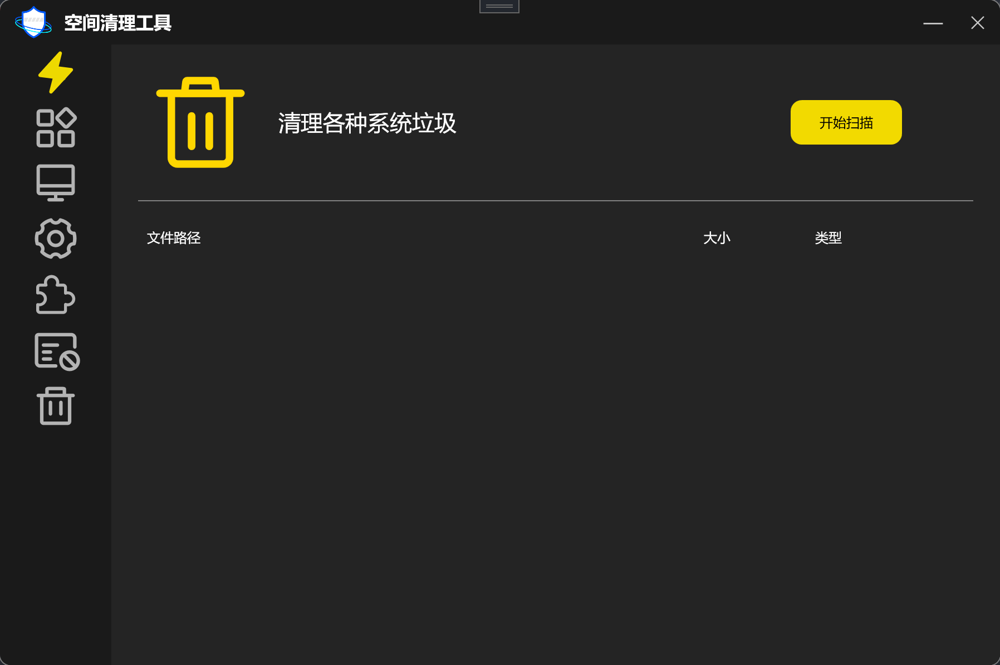

# CleanMaster-Toolkit
基于C#的系统垃圾清理工具，支持注册表安全扫描
#空间清理工具 (Space Cleaning Tool)

一个功能强大的 Windows 磁空间清理工具，采用现代化的 WPF 界面设计，提供全面的系统清理解决方案。

### 应用起始界面


##功能特性

###统清理

- **临时文件清理** - 清理系统和用户临时文件夹中的 `.tmp`、`.log`、`.bak`等临时文件
- **缓存文件清理** - 清理系统缓存文件，释放磁盘空间
- **日志文件清理** -清理各种应用程序产生的日志文件

### 📱 应用清理

- **自定义目录扫描** -支持用户添加任意目录进行垃圾文件扫描
- **多种文件类型识别** - 识别 `.tmp`、`.log`、`.bak`、`.old`、`.gid`、`.chk`、`.dmp`、`.cache` 等垃圾文件
- **文件锁定检测** -跳过正在使用的文件，避免系统冲突

###🔐 清理

- **浏览器数据清理** -支持主流浏览器的隐私数据清理
  - Google Chrome
  - Microsoft Edge
  - Mozilla Firefox
  - 360 安全浏览器
  - QQ 浏览器
- **数据类型覆盖** - 清理缓存、历史记录、Cookies 等隐私数据
- **智能路径检测** - 自动检测浏览器用户数据目录

### 📋 注册表清理

- **无效项扫描** -检测并清理注册表中的无效项
- **残留卸载项清理** -清理软件卸载后残留的注册表项
- **空键检测** - 识别并清理无值无子项的空注册表键
- **管理员权限** -需要管理员权限以确保清理安全

###🔌 插件清理

- **浏览器插件扫描** -检测浏览器插件和扩展
- **插件缓存清理** -清理插件产生的缓存文件
- **管理员权限** -需要管理员权限进行深度扫描

###💥 粉碎

- **安全删除** - 通过多次覆写确保文件无法恢复
- **多层覆盖算法** -
  - 第一次：0x00
  - 第二次：0xFF 填充
  - 第三次：随机数据填充
- **文件解锁机制** - 自动检测并解锁被占用的文件
- **目录递归粉碎** -支持整个目录树的安全删除

###♻ 回收站管理

- **统一回收机制** -所有清理的文件都移动到统一的回收目录
- **文件恢复** -支持从回收站恢复误删的文件
- **元数据保存** - 保留文件原始路径信息
### 垃圾回收站


##🖥 面设计

###现代化 UI

- **暗色主题** -的深色界面设计
- **金色点缀** -精心设计的金色高亮元素
- **圆角设计** -现代化的圆角窗口和控件
- **图标按钮** -直观的图标导航系统

### 交互体验

- **实时进度显示** -清晰的进度条反馈
- **悬停提示** - 详细的工具提示信息
- **状态切换** -扫、清理状态的智能切换
- **取消功能** -支持扫描过程中的取消操作

##🛠️ 技术架构

### 开发环境

- **.NET Framework 4.8**
- **WPF (Windows Presentation Foundation)**
- **C# 语言**

###核心依赖

- **MaterialDesignThemes** - 现代 UI 组件库
- **Windows API Code Pack** - Windows 系统功能封装
- **Microsoft.Xaml.Behaviors** - XAML 行为扩展

### 项目结构

```
SpaceCleaning/
├── BaseControl/           # 自定义控件
│  └── ImageButton.cs    # 图标按钮控件
├── Resources/            # 图标资源文件
├── Properties/          # 项目属性配置
├── *.xaml               #界面文件
├── *.xaml.cs            # 界面逻辑代码
└── packages.config      # NuGet包配置
```

##🔧 装与部署

###系统要求

- Windows 7 SP1 或更高版本
- .NET Framework 4.8 运行时 -管理员权限（部分功能需要）

###部署方式

1. **直接运行** - 使用 Visual Studio 编译后直接运行
2. **ClickOnce 发布** -支持自动更新的部署方式
3. **安装包** - 可生成标准的 Windows 安装程序

###编译步骤

```bash
# 1.打开解决方案
SpaceCleaning.sln

# 2.还NuGet包
nuget restore

# 3. 编译项目
msbuild SpaceCleaning.sln /p:Configuration=Release
```

## 📖 使用指南

###基本操作流程

1. **启动程序** -双 `SpaceCleaning.exe`
2. **选择功能** - 点击左侧功能图标选择清理类型
3. **开始扫描** - 点击"开始扫描"按钮
4. **查看结果** -浏览扫描到的垃圾文件列表
5. **执行清理** - 确认后点击"一键清理"

### 注意事项

-🔒 重要文件** -清理前请确认文件重要性
-👮 权限要求** - 注册表和插件清理需要管理员权限
-🌐 **浏览器关闭** -清理浏览器数据前请关闭相应浏览器
-📁 备份建议\*\* - 重要数据建议先备份

###安全机制

- **回收机制** - 文件先移动到回收目录，可恢复
- **权限验证** - 关键操作前进行权限检查
- **文件锁定检测** -删除正在使用的文件
- **确认对话框** - 重要操作前二次确认

##🎯 最佳实践

###定清理建议

- **系统清理** -执行一次
- **隐私清理** -每月执行一次
- **注册表清理** -执行一次
- **文件粉碎** - 仅在需要安全删除时使用

###性能优化

- **关闭无关程序** -清理前关闭不必要的应用程序
- **系统空闲时操作** - 在系统负载较低时执行清理
- **分批处理** -大量文件建议分批清理

##🆘 故障排除

###常见问题

1. **权限不足**

   - 以管理员身份运行程序 -检查用户账户控制(UAC)设置

2. **文件被占用**

   - 关闭相关应用程序
   - 重启系统后重试

3. **扫描无结果**

   - 确认选择了正确的目录 -检查目标路径是否存在垃圾文件

4. **清理失败** -检查磁盘空间是否充足 -确认回收目录权限

### 日志查看

程序运行时的详细信息输出到 Debug 控制台，可通过以下方式查看：

- Visual Studio 调试输出窗口
- DebugView 工具

## 📄 许证

本项目仅供学习和研究使用，请勿用于商业用途。

##🙏 致谢

感谢以下开源项目的支持：

- MaterialDesignThemes
- Windows API Code Pack
- Microsoft.Xaml.Behaviors

##📞 联系方式

如有问题或建议，请通过以下方式联系：
邮箱：3038136139@qq.com
电话：15392775211

- 提交 Issue
- 发送邮件至开发者

---

_最后更新：2026 年 2 月_
